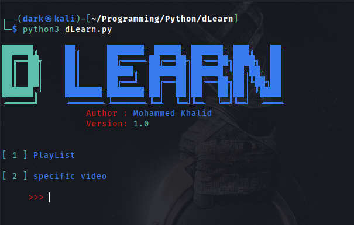
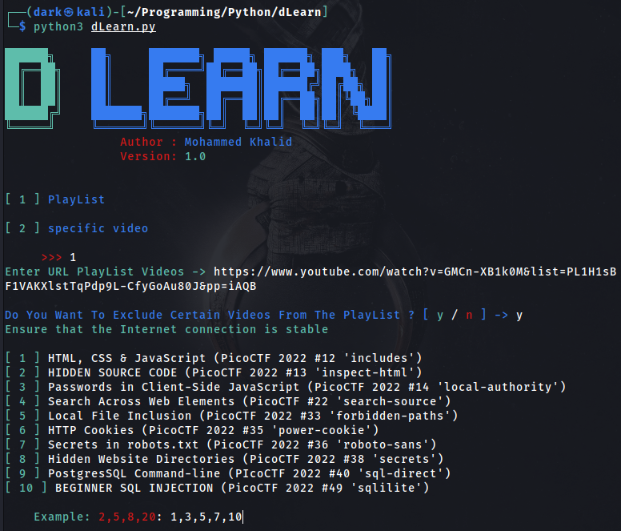
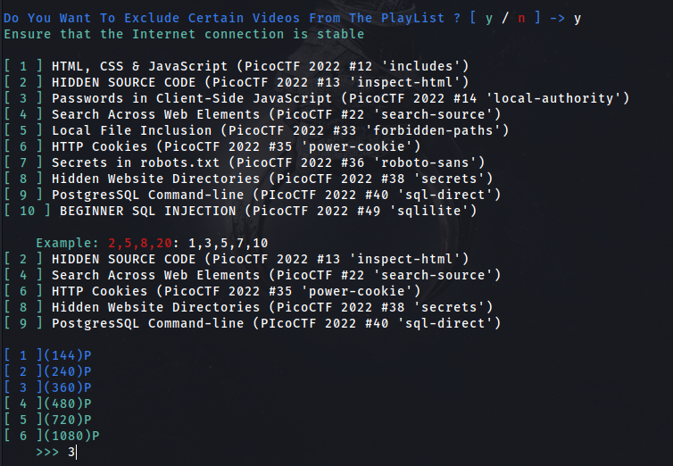
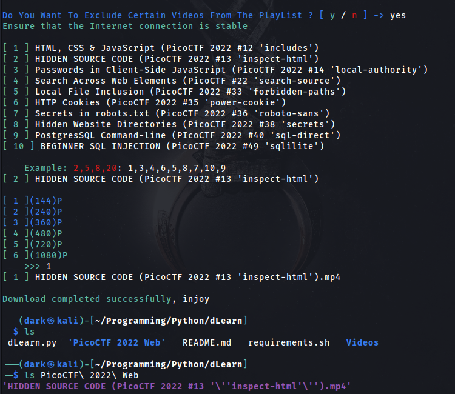
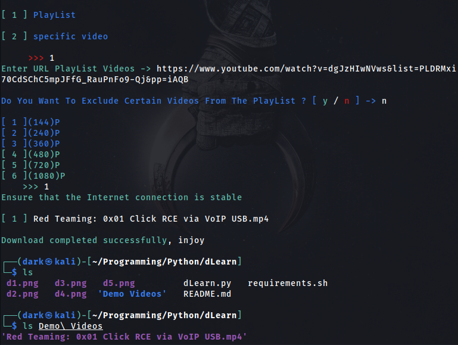
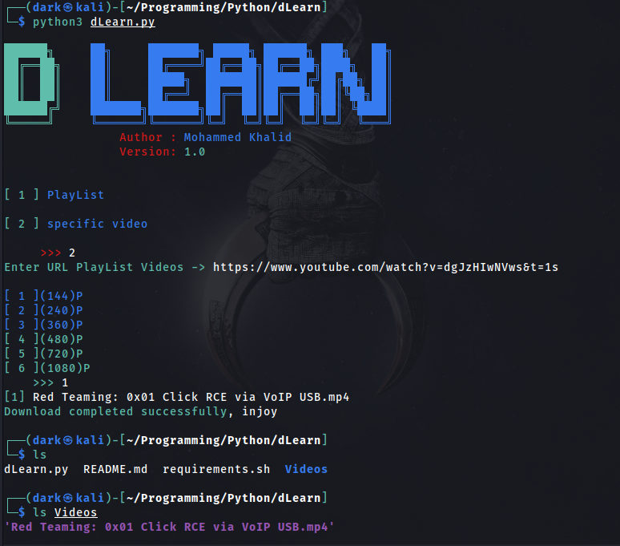

# dLearn

**dLearn** : The d Learn tool downloads the lists and educational videos that you aspire to learn 
from **YouTube** (this is its main goal)
It saves you the trouble of going to sites that may be suspicious, as it saves you time and effort


## Features
*	You can exclude certain videos from playlists, to suit your need
*	You can download the videos in the quality you want
*	You can download a specific video (Case 1)

## Upcoming updates
*   More than one other quality will be added to the videos
*   console user interface (CLI) will be supported , To be able to enter parameters faster
*   You can compress files
*   Download videos from other sources (Udemy , Mega)
*   Convert videos to music (MP3)
*   And More ...

## Installation
Download dLearn by cloning the Git repository:
<br />```$ git clone https://github.com/Dark-Night0/dLearn.git```
<br />```$ chmod +x requirements.sh```
<br />```$ ./requirements.sh ```

## Usage
<br />```$ python3 dLearn.py```
<br />


## Cases (YouTube)
* Case 1 (Exclude certain videos)

<br />
<br />

<br />
# OR


<br />

* Case 2 (Videos are not excluded)

<br />

* Case 3 (Download a specific video)

<br />
<br />

## Author

Mohammed Khalid (0xDARK)
<br />

## Contacts
 **Facebook** 
* [Mohammed Khalid](https://www.facebook.com/profile.php?id=100085121092587)

 **Twitter** 
* [0xDARK3](https://twitter.com/0xDARK3)

 **Linkedin** 
* [Mohammed Khalid](https://www.linkedin.com/in/mohammed-khalid-3b43a51b3?fbclid=IwAR0LdK7KAb_etFC8qdXQBg-9ApWOfxNZHY1CwuVUe52AgpycPZcdUU9-pt0)

<br>

 **Medium** 
* [0xDARK](https://medium.com/@0xDARK)
